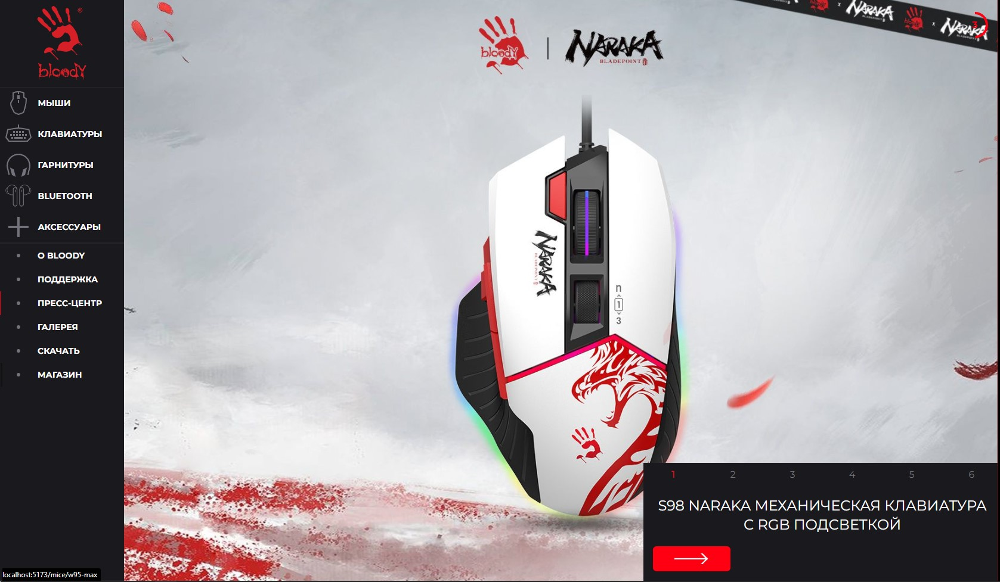
# "BLOODY" - приложение на ReactJS.
### ⚠ Вступление
Переписана основная часть официального сайта [www.bloody.com](http://www.bloody.com/ru/index.php) на ReactJS.

Стек: **front-end:** ReactJS, TS, TailwindCSS / **back-end:** Strapi (Headless CMS).

### 📓 Содержание

[1. Установка](#install)\
[2. Обновление](#update)\
[3. Дополнительная информация](#info)\
[4. Лицензия](#license)\
[5. Разработчик](#developer)\
[6. Скриншоты](#screenshots)

## ⚙ Установка

1. Клонируйте данный репозиторий или скачайте архив (с последующей распаковкой в удобное место на компьютер) по [адресу](https://github.com/lukashevVitaliy/Bloody).
2. Откройте данный проект на компьютере в редакторе.
3. Откройте в редакторе терминал и установите автоматически все пакеты зависимостей проекта, с помощью команд `yarn` или `npm install`.
4. **ВАЖНО!!! Перед запуском приложения, необходимо скачать, установить и запустить приложение на STRAPI (back-end), которое хранит все данные, необходимые для запуска и нормального функционирования данного приложения. Если этого не выполнить, приложение работать не будет !!!**
   [Ссылка на репозиторий для скачивание приложения на STRAPI](https://github.com/lukashevVitaliy/Bloody-and-Strapi).
5. Запуск проекта, осуществляется с помощью команд `yarn dev` или `npm dev` в терминале, в зависимости от используемого пакетного менеджера.

## 📌 Обновление

- [x] изменен дизайн скроллов на кастомные, в отличии от стандартного решения;
- [x] изменена анимация карточек с товарами;
- [x] переработана галерея с изображениями;
- [x] произведена корректная адаптация под desktop и mobile устройства;
- [x] изменен шрифт и его параметры.

## 👉 Дополнительная информация

- [x] Компонентный подход и их переиспользываемость.
- [x] Произведена оптимизация по исключению лишних перерисовок приложения.
- [x] Использован React Lazy Load (ленивая загрузка).
- [ ] Временно не реализована мультиязычность.
- [ ] Необходима мелкая корректировка по проекту - исправить уведомления от eslint.
- [ ] На данный момент, один из форматов изображений приложения - \*.jpg, к которому планируется добавить \*.webp, для улучшения производительности приложения.

## © Лицензия

Все права защищены: www.bloody.com

## 💻 Разработчик

**_=== Vitalii Lukashev ===_**

[Контакты для связи со мной](https://github.com/lukashevVitaliy)

## 👀 Скриншоты

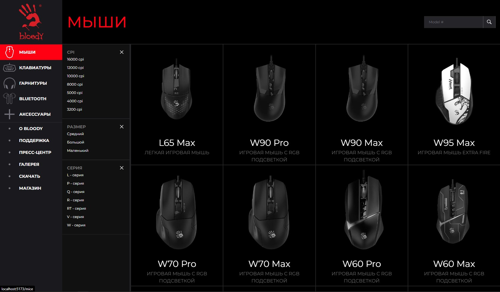
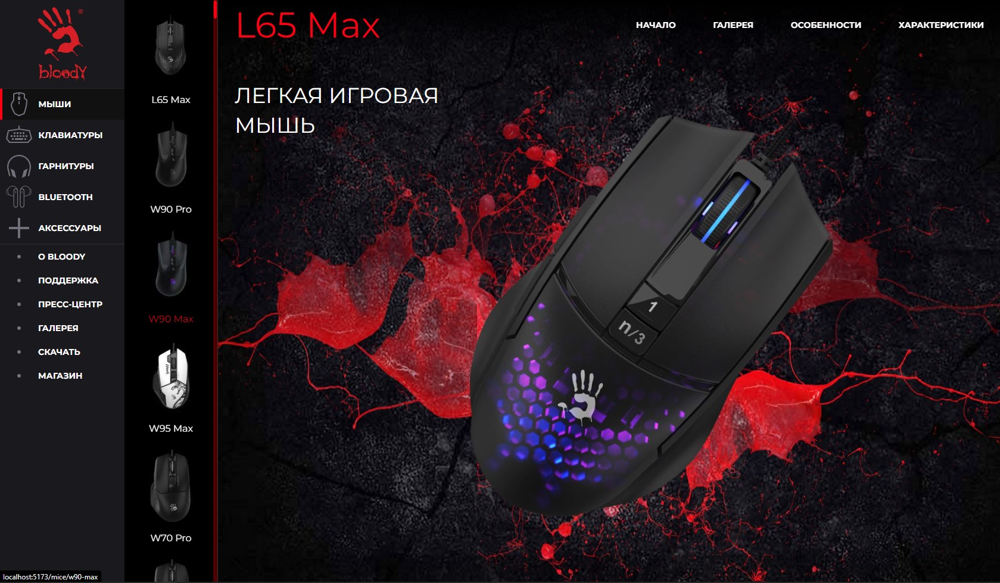
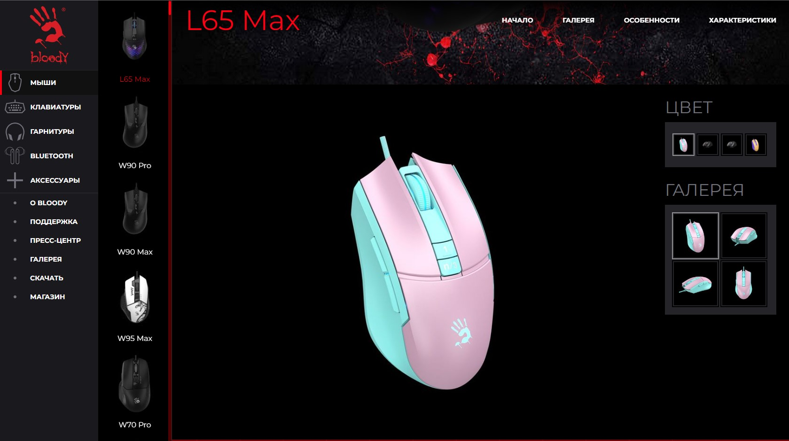
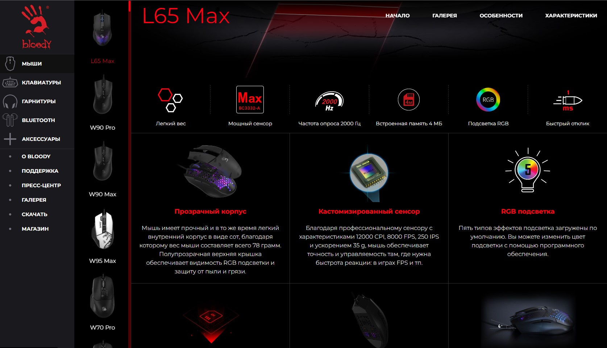
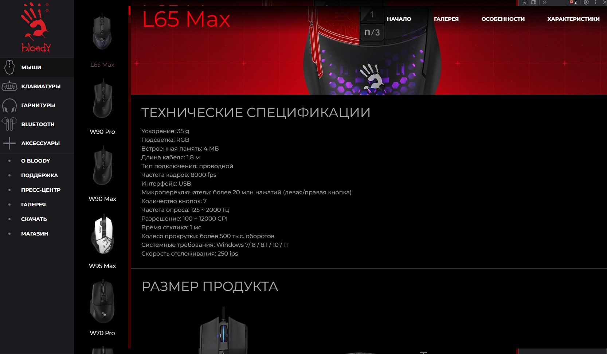
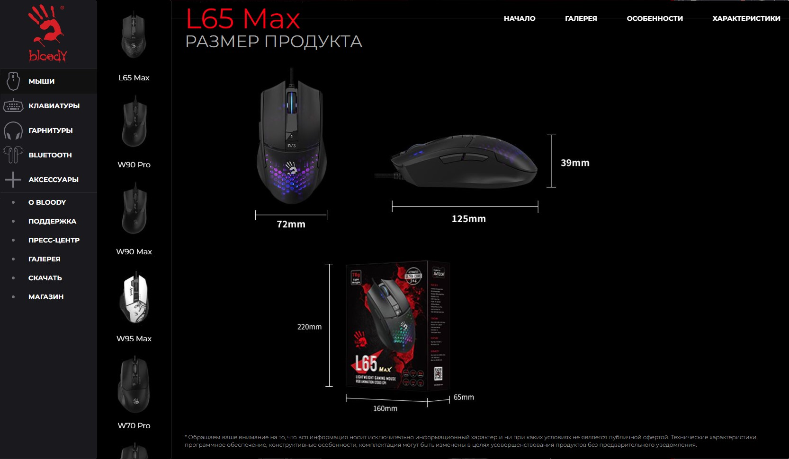
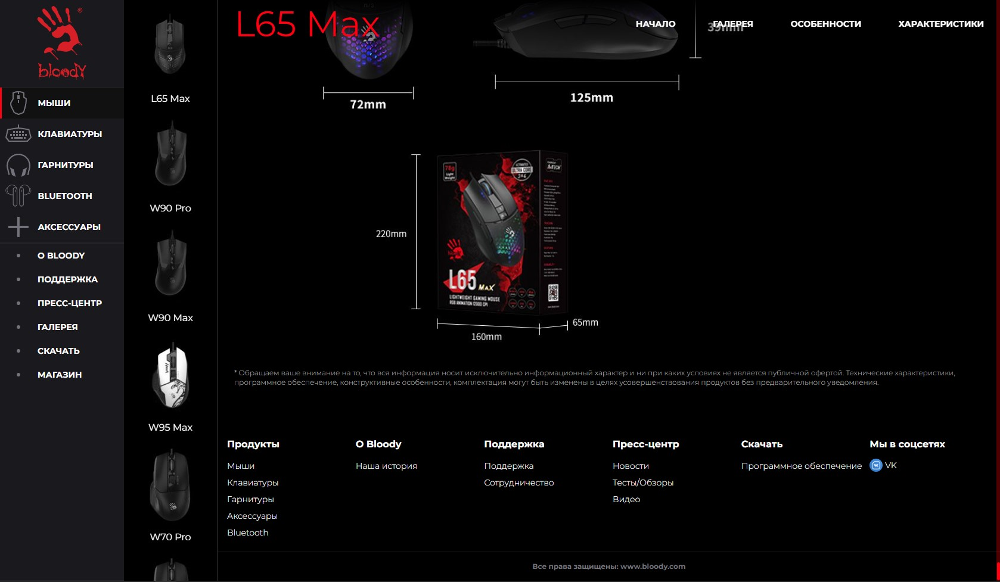
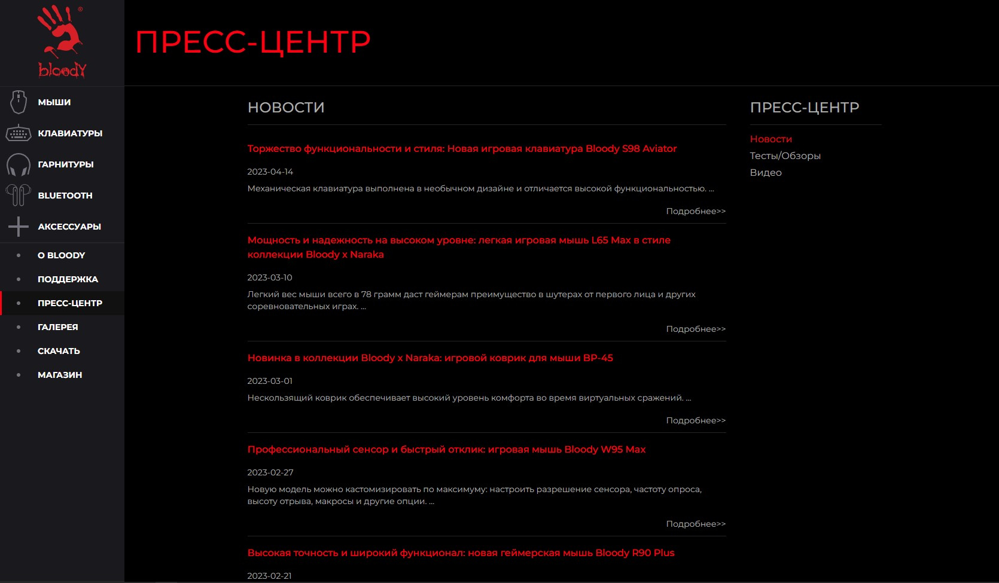
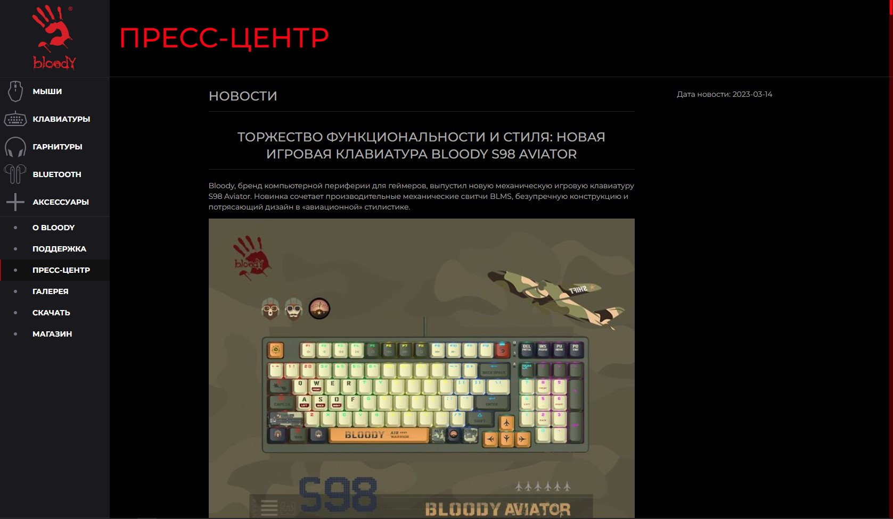
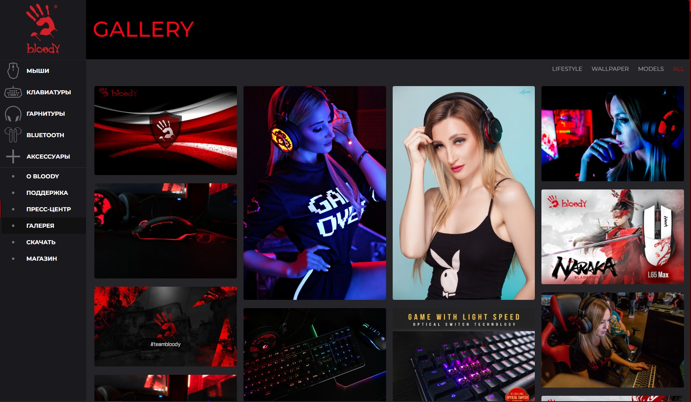
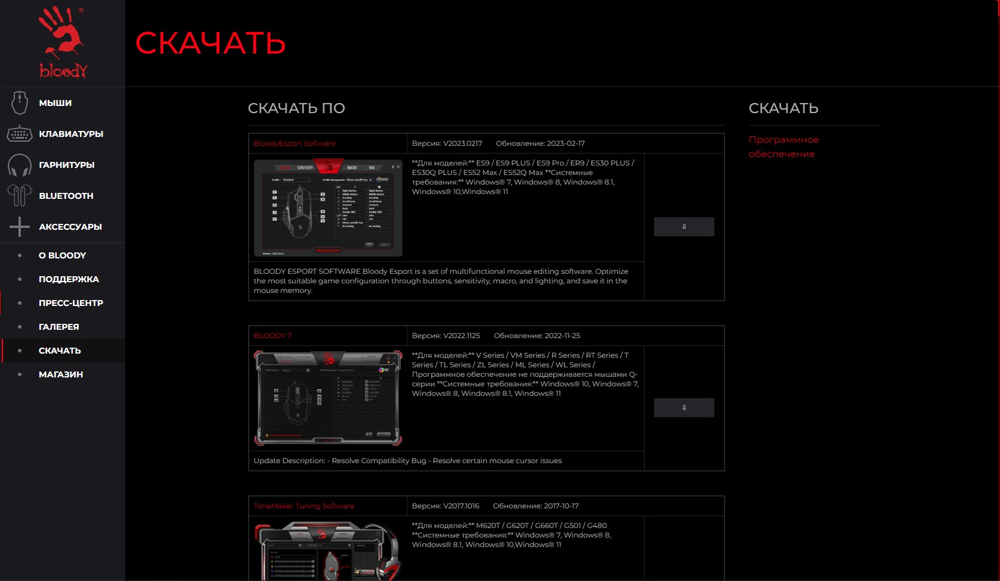
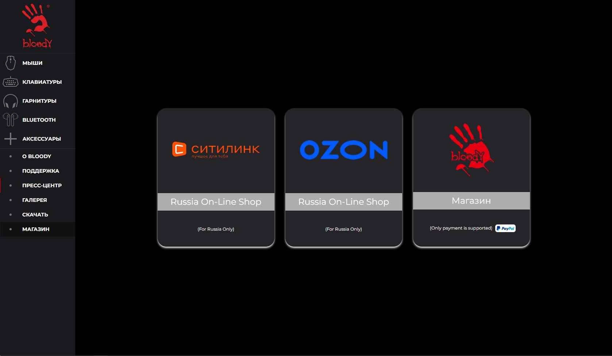
